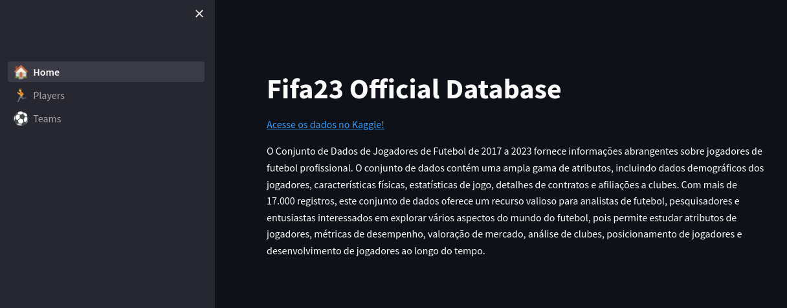

# Fifa 2023 Database
Demonstração da visualização de dados com Streamlit + Pandas usando a database do Fifa 2023.

## How To Use

1. Instale o [Docker](https://docs.docker.com/desktop/).

2. Clone o ambiente para um local de sua escolha.

3. em um terminal, execute o seguinte:
```bash
cd <diretorio do projeto>
docker build -t <nome_do_imagem> .
```

4. Aguardar o build terminar.

5. em um terminal, execute o seguinte:
```bash
docker run <nome_do_imagem>
```
6. abra o site em seu navegador inserindo a url fornecida.


## Imagens

### Home


### Jogadores


### Times

